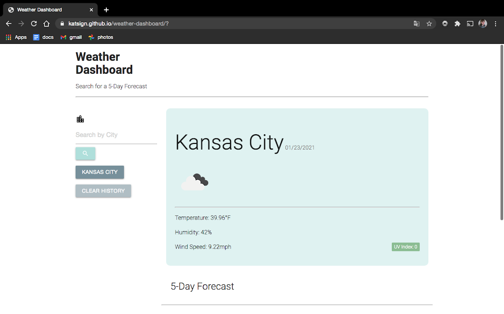
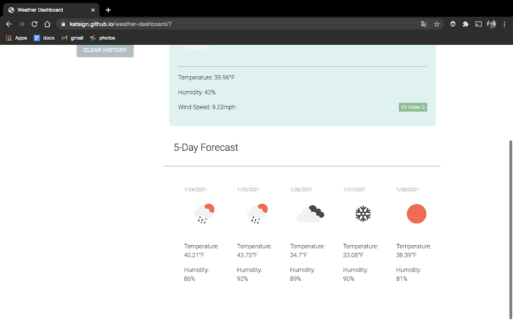
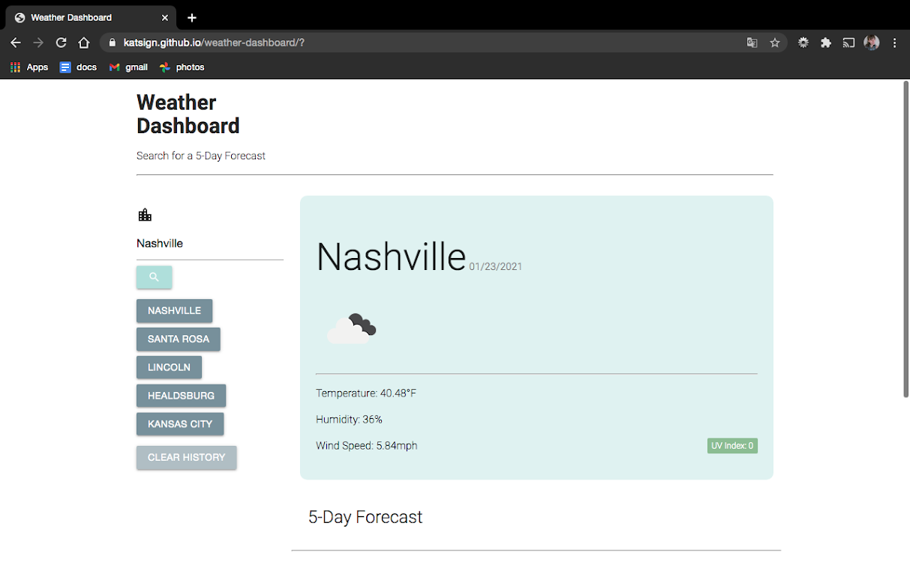
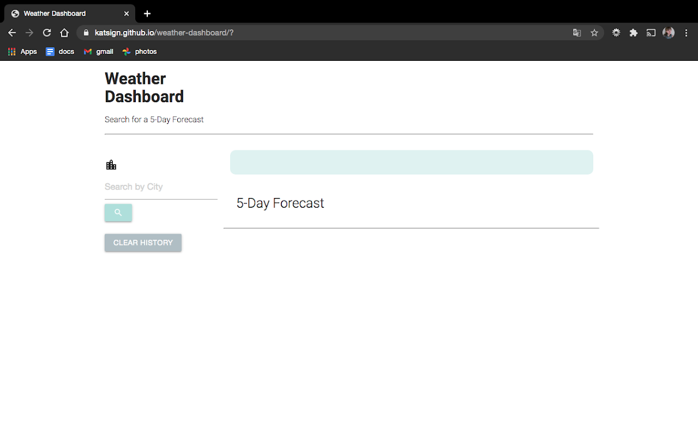

# Minimalist Weather Dashboard :cloud:
## A predictive weather dashboard that uses the OpenWeatherMap API, featuring dynamically updated HTML and CSS.
Following closely with the given acceptance criteria, I built a minimalist in-browser weather app that searches by city using [OpenWeatherMap](https://home.openweathermap.org/). I used everything I've learned about coding so far to build an HTML shell, populate it with DOM manipulation, and style the end result with a new CSS framework [Materialize](https://materializecss.com/).

## Demo of Searching by City

### The following images show the browser view for the search, "Kansas City." Users are met with a search input that will trigger an API call for that city, retrieving the current weather and the next five days' forecasts.

### The user can then search as many queries as they want as long as they are using the city name, and when finished browsing, clear the saved searches from the Search History list.

Above: the unpopulated div and button list after local storage has been cleared. This also displays when a user is using the app for the first time.

## Credits

### :sparkles: [Materialize CSS](https://materializecss.com/)
### :cloud: [Open Weather Map](https://home.openweathermap.org/)
### :blue_book: [Google Fonts](https://code.jquery.com/)
### :globe_with_meridians: [jQuery CDN](https://fonts.google.com/)
